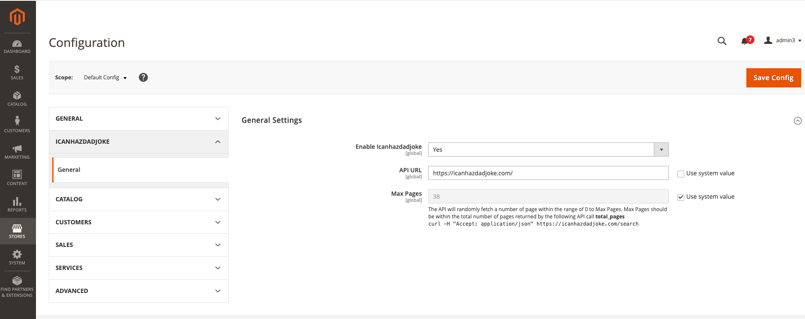

# Sh Icanhazdadjoke Extension

The **Sh Icanhazdadjoke Extension** adds functionality to your Magento store to fetch and display random dad jokes from the [icanhazdadjoke API](https://icanhazdadjoke.com/). This extension provides a fun way to engage customers with random jokes and is configurable through the Magento admin panel. 

=====================

## Requirements
------------
- PHP >= 7.4
- The `curl` extension must be enabled in PHP for API requests.
- Access to the internet for fetching data from the [icanhazdadjoke API](https://icanhazdadjoke.com/).
- Magento >= 2.0.


## Installation Instructions
-------------------------

1. Copy the module folder to the `app/code/Sh/Icanhazdadjoke` directory in your Magento 2 root project.

2. Run the following commands from the Magento root directory to enable the module and update the setup:
    ```bash
    php bin/magento module:enable Sh_Icanhazdadjoke
    php bin/magento setup:upgrade
    php bin/magento cache:clean
    ```

3. Navigate to `Stores > Settings > Configuration > Icanhazdadjoke` to modify the configuration settings.

### Default Configuration Values:
- **API URL:** `https://icanhazdadjoke.com/` (This is the default value but can be modified in the admin configuration.)
- **Max Pages:** `38` (This sets the default number of pages, which can also be modified in the admin configuration.)

These default values are pre-configured:



## Admin Listing Panel Example
-------------------------
`Content > Jokes > List `
Here is an example of the Admin Listing Panel where the jokes are displayed:


## Front-End Example
-------------------------
The following is an example of how the jokes appear on the front end of your Magento store:


## Compatibility
-------------
- Magento >= 2.0

## Uninstallation
--------------
1. Remove all extension files from your Magento installation.
2. Run the following commands to disable the module and clean up:
    ```bash
    php bin/magento module:disable Sh_Icanhazdadjoke
    php bin/magento setup:upgrade
    php bin/magento cache:clean
    ```
3. Clear the cache and recompile the codebase if necessary.
4. Remove the configuration settings from the admin panel.

## License
-------
[OSL - Open Software Licence 3.0](http://opensource.org/licenses/osl-3.0.php)

## Copyright
---------
(c) 2024 Sh
